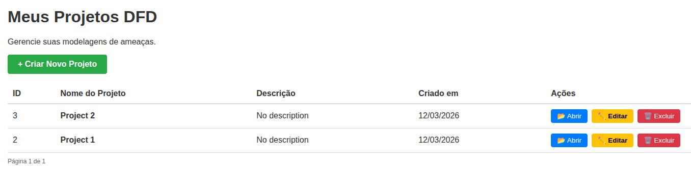
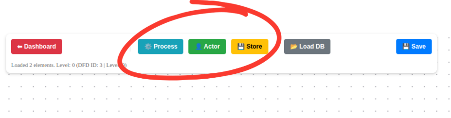
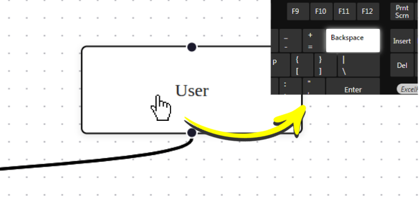
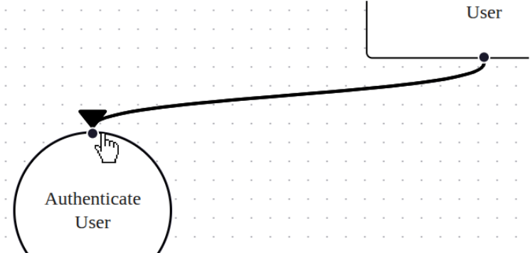
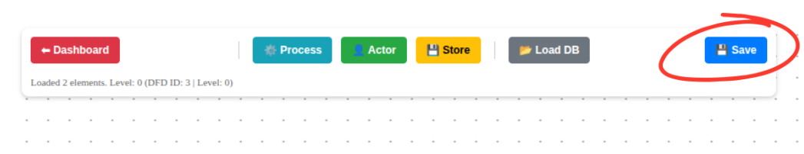
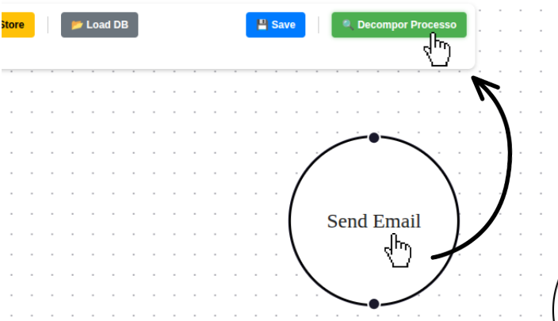
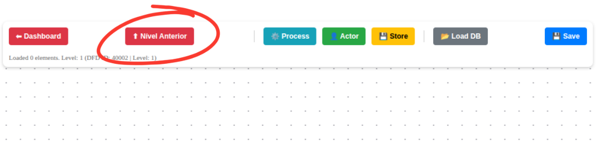
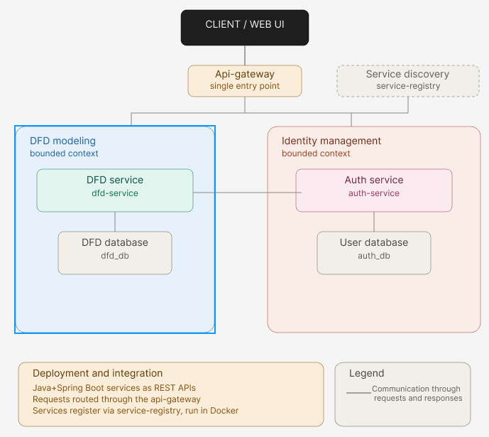

# DFD Service

Este projeto consiste em uma API desenvolvida em React (front-end), .NET 10 (back-end) e SQL Server (database) para a gestão de Diagramas de Fluxo de Dados (DFD).

---

### Observação importante sobre essa versão

No momento, a remoção de um fluxo de dados (seta) salvo não está implementada. Dessa forma, não é possível remover setas salvas na modelagem de um diagrama.

Nas próximas sprints esperamos resolver essa pendência e finalizar essa funcionalidade.

# 1. Instruções para Execução do Projeto

Esta seção detalha os procedimentos necessários para inicializar o ambiente completo, incluindo o banco de dados, o script de configuração inicial e o serviço de backend.

## 1.1. Pré-requisitos

Para a execução deste projeto, é indispensável a instalação prévia das seguintes ferramentas:

- Docker Compose: Orquestrador de múltiplos containers.
- Git: Sistema de controle de versão.

---

## 1.2. Procedimento de Instalação

### Clonagem do Repositório
Opção 1: Via SSH

    git clone git@github.com:Threat-Model-TCC/dfd-service.git
    cd dfd-service

Opção 2: Via HTTP

    git clone https://github.com/Threat-Model-TCC/dfd-service.git
    cd dfd-service

### Inicialização dos Serviços:
Certifique-se de que as portas 5000 (API), 1445 (SQL Server) e 3000 (front-end) não estejam sendo utilizadas por outros processos. Na raiz do diretório, execute:

    docker-compose up --build

Acesse a ferramenta localmente pela url:

    localhost:3000/

Verificação de Inicialização:
O serviço dfd_backend possui uma dependência de integridade (healthcheck) em relação ao sqlserver. A API estará plenamente disponível para consumo assim que a mensagem Application started for exibida nos logs do console.

# 2. Documentação da API e Endpoints

## 2.1. Swagger
A interface de documentação e testes da API é provida pelo Swagger (OpenAPI), permitindo a interação direta com os recursos disponíveis.

    URL de Acesso: http://localhost:5000

## 2.2. Endpoints

| Recurso | Método | Endpoint | Descrição | Status | Auth |
|--------|--------|----------|-----------|--------|------|
| Projetos | GET | /api/v1/projects | Recupera uma lista paginada de projetos cadastrados. | 200 | No |
| Projetos | POST | /api/v1/projects | Cria um novo projeto e instancia automaticamente seu diagrama de contexto (Nível 0). | 201 | No |
| Projetos | GET | /api/v1/projects/{id} | Obtém os detalhes de um projeto específico pelo seu identificador. | 200 | No |
| Projetos | PUT | /api/v1/projects/{id} | Atualiza o título e a descrição de um projeto existente. | 200 | No |
| Projetos | DELETE | /api/v1/projects/{id} | Remove um projeto e todos os diagramas e elementos vinculados (deleção em cascata). | 204 | No |
| Diagramas (DFD) | GET | /api/v1/dfd/{id} | Recupera os metadados de um diagrama específico. | 200 | No |
| Diagramas (DFD) | POST | /api/v1/dfd/child | Cria um sub-diagrama (filho) a partir de um elemento do tipo Processo. | 201 | No |
| Diagramas (DFD) | PUT | /api/v1/dfd/{id}/elements | Sincroniza (cria ou atualiza) a lista de elementos (Atores, Processos, DataStores) de um DFD. | 200 | No |
| Elementos | DELETE | /api/v1/dfd-elements/{id} | Remove um elemento individual do diagrama. | 204 | No |

# 3 Banco de dados
Para acessar o banco de dados rode o comando:

    docker exec -it sql2022_db /opt/mssql-tools18/bin/sqlcmd    -S localhost -U sa -P 'SuaSenhaForte123!' -d dfd_db -C

# 4. Usabilidade

Esta seção descreve como interagir com a ferramenta e utilizar suas principais funcionalidades para modelagem de Diagramas de Fluxo de Dados (DFD).

---

## 4.1. Tela de Projetos

A tela de projetos é a interface inicial da aplicação. Nela, o usuário pode:

- Visualizar projetos existentes;
- Criar novos projetos;
- Editar informações de projetos;
- Excluir projetos.

Ao acessar um projeto, o usuário é automaticamente redirecionado para o canvas contendo o DFD de nível 0 (diagrama de contexto).

---

## 4.2. Tela do Canvas

A tela do canvas é responsável pela modelagem dos diagramas DFD.

### 4.2.1. Criação de Elementos

Para criar um elemento (`Actor`, `Process` ou `DataStore`), basta selecionar o tipo desejado. O elemento será automaticamente adicionado ao canvas e será solicitado um nome para identificá-lo.

---

### 4.2.2. Remoção de Elementos

Para remover um elemento do diagrama, clique sobre ele e pressione a tecla `Backspace` do teclado.

---

### 4.2.3. Criação de Fluxos de Dados (Setas)

Para criar um fluxo de dados entre dois elementos, clique no ponto de conexão do elemento de origem e arraste o mouse até o ponto de conexão do elemento de destino.

---

### 4.2.4. Salvamento das Alterações no Canvas

As alterações realizadas no canvas somente são persistidas no banco de dados ao clicar no botão `Save to DB`.

Esse botão é responsável por salvar o estado atual do diagrama.

---

### 4.2.5. Acesso ao Próximo Nível do DFD

Ao clicar em um elemento do tipo `Process`, será exibida a opção `Decompose`. Ao selecioná-la, o usuário será redirecionado para o próximo nível do diagrama, permitindo detalhar o processo selecionado.

> **Observação importante:** somente é possível decompor um processo caso o DFD atual já tenha sido salvo.

---

### 4.2.6. Retorno ao Nível Anterior do DFD

Quando o usuário estiver em um diagrama diferente do nível 0 (contexto), será exibido o botão `Return to Previous Level`.

Ao clicar nesse botão, o usuário será redirecionado ao diagrama anterior.

> **Observação importante:** somente é possível retornar ao nível anterior caso o DFD atual esteja salvo.

## 5. Arquitetura de Microsserviços

O sistema foi desenhado em uma arquitetura distribuída e atualmente é composto por 4 serviços principais:

*   **`auth-service`**: Responsável pela gestão de identidades, controle de acesso e autenticação dos usuários de forma segura. Possui seu próprio banco de dados **`auth_db`**.
*   **`dfd-service`**: Domínio principal (Core) da aplicação. Gerencia todo o ciclo de vida dos projetos e as operações relacionadas aos Diagramas de Fluxo de Dados (DFDs). Possui seu próprio banco de dados **`dfd_db`**.
*   **`api-gateway`**: Atua como o ponto único de entrada (*Single Point of Entry*) do sistema. Ele abstrai a complexidade interna, recebendo as requisições externas e realizando o roteamento reverso para o microsserviço adequado.
*   **`service-registry`**: Atua como o mecanismo de *Service Discovery*. Mantém o registro dinâmico das instâncias e portas dos microsserviços em execução, permitindo que eles se comuniquem internamente de forma transparente, sem a necessidade de acoplamento a IPs estáticos.

